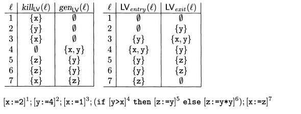

# Static Analysis for the *JWhile* Lang with Java

## Introduction
This is my implementation of the challenge proposed by  [rbonifacio](https://github.com/rbonifacio/) during the lectures about **Algorithms and Complexity**.
I used **ANTLR4** to specify and parse the JWhile language which is very similiar to the While language proposed in book **Principles Of Program Analysis, by Flemming Nielson et al**. This is the summary of what has been implemented
- The monotone framework 
- Live Variable Analysis 
- Very Busy Expressions Analysis
- Reaching Definitions
- Available Expressions
- Interpreter for the *jwhile*


## *JWhile*
JWhile is just While with semicolons, braces and literal just as in java, but the variable type is not necessary. 
See the example shown below.
```java
    x=2;
    y=4;
    x=1;
    if(y>x){
        z=y;
    }else{
        z=y*y;
    };
    x=z;
```


## Monotone Framework
The following picture shows the monotone framework just as presented in the book Principles of Program Analysis.


The basic idea of this java implementation is that each algorithm should be **parameterized** based on the following items.
- The base class for all algorithms is the following class
  - ```java
      abstract class Algorithm<T extends AnalysisInformation<? extends Comparable<?>>> 
      ```
- Each algorithm should extend the base class specifing the focus of analysis (AnalysisInformation.java)
  - ```java
      //this is how ReachingDefinitions declares its focus of analysis
      class ReachingDefinitions extends Algorithm<AnalysisInformation<Pair<Label, String>>>
    ```
- Each algorithm must declare its general terms, by concrete implementations of the following methods
  - ```java
      // the initialization set
      public abstract Set<T> getInitSet();
      
      // enuns CONCERNS_ENTRY_CONDITIONS or CONCERNS_EXIT_CONDITIONS
      public abstract ConcernType getConcernType();
      
      // enuns FORWARD or BACKWARD
      public abstract FlowType getFlowType();
      
      public abstract Set<T> gen(Node n);
      public abstract Set<T> kill(Node n);
      
      // enuns MAY or MUST
      public abstract MeetOperator getMeetOperator();
      
      // sometimes init(S*) or someimes final(S*) - see picture below
      public abstract List<Node> getExtremeEdges();
      
      // sometimes, the superset is necessery so that it can be used to construct 
      // the so called "least solution"
      public abstract Set<T> findSuperset();
    ```    

## Persistence
I've used a very different strategy than the one that is found in other immplementations.
After the **Abstract Syntax Tree** is provided by ANTLR4, a Graph is persisted into Neo4J database using the **Vistor Pattern**.
I named this graph as *"Enriched Control Flow Graph"*, since it has more information than the usal control flow graph presented in the book.
In the following picture you can see that it is possible to find in the graph, references to *Identifiers*, *Literals* and even to *Trivial* and *Non Trivial Expressions*.
The idea is that, for larger projects, it shouldn't be enough to trust RAM memory as the backend for the Static Analysis.
Notice that if the program crashes, everything is lost. Also, if you would like to analyze a software again, each time, the hole process should be taken.
**By this, I would like to make clear that my motivation is to consider the possibility of using a backend as a repository for Analysis Information**.
This backend should be able to support a very large amount of graph data, that is why Neo4J had been choosen.


## Results
For every analysis, its presented a screen capture of the book *Principle of Program Analysis* since it was used as reference.
There might be some differences, since my label generation scheme is sequential and based on the Visitor Pattern.
This means that extra care should be taken while comparing the results. Also, I've implemented the concept of Non Trivial Expressions also for BExps, and this is surely going to produce some differences.

### If you are not familiar, try look at everything at once!
If you are spending some time with the framework, at least for me, to look at everything at once was of a great help.


### Available Expressions

#### My Results
<pre>
Available Expressions
My Label  Node   KILL                 GEN      ENTRY        EXIT         PPA Label        
0         START  {}                   {}       {}           {}           
1         x=a+b  {}                   {a+b}    {}           {a+b}        1  
2         y=a*b  {y>a+b}              {a*b}    {a+b}        {a+b,a*b}    2 
3         a=a+1  {a+b,a+1,a*b,y>a+b}  {}       {a+b,y>a+b}  {}           4 
4         x=a+b  {}                   {a+b}    {}           {a+b}        5  
5         y>a+b  {}                   {y>a+b}  {a+b}        {a+b,y>a+b}  3 
6         END    {}                   {}       {a+b,y>a+b}  {a+b,y>a+b}   
</pre>

---

### Very Busy Expressions

#### My Results
<pre>
Very Busy Expressions
My Label  Node   KILL  GEN    ENTRY      EXIT       PPA Label        
0         START  {}    {}     {b-a,a-b}  {b-a,a-b}    
1         x=b-a  {}    {b-a}  {a-b,b-a}  {a-b}      2  
2         y=a-b  {}    {a-b}  {a-b}      {}         3  
3         y=b-a  {}    {b-a}  {a-b,b-a}  {a-b}      4  
4         x=a-b  {}    {a-b}  {a-b}      {}         5  
5         a>b    {}    {}     {b-a,a-b}  {b-a,a-b}  1
6         END    {}    {}     {}         {}           
</pre>

---

### Reaching Definitions Analysis


#### My Results
<pre>
Reaching Definitions
My Label  Node   KILL           GEN      ENTRY                      EXIT                       PPA Label        
0         START  {}             {}       {}                         {}                           
1         x=5    {<1,x>,<4,x>}  {<1,x>}  {}                         {<1,x>}                    1  
2         y=1    {<2,y>,<3,y>}  {<2,y>}  {<1,x>}                    {<1,x>,<2,y>}              2  
3         y=x*y  {<2,y>,<3,y>}  {<3,y>}  {<2,y>,<1,x>,<3,y>,<4,x>}  {<1,x>,<4,x>,<3,y>}        4  
4         x=x-1  {<1,x>,<4,x>}  {<4,x>}  {<3,y>,<1,x>,<4,x>}        {<3,y>,<4,x>}              5  
5         x>1    {}             {}       {<2,y>,<1,x>,<3,y>,<4,x>}  {<2,y>,<1,x>,<3,y>,<4,x>}  3  
6         END    {}             {}       {<2,y>,<1,x>,<3,y>,<4,x>}  {<2,y>,<1,x>,<3,y>,<4,x>}  
</pre>

---

### Live Variable Analysis


#### My Results
<pre>
Live Variables
My Label  Node   KILL  GEN    ENTRY  EXIT   PPA Label        
0         START  {}    {}     {}     {}       
1         x=2    {x}   {}     {}     {}     1  
2         y=4    {y}   {}     {}     {y}    2  
3         x=1    {x}   {}     {y}    {y,x}  3  
4         z=y    {z}   {y}    {y}    {z}    5  
5         z=y*y  {z}   {y}    {y}    {z}    6
6         y>x    {}    {y,x}  {y,x}  {y}    4  
7         x=z    {x}   {z}    {z}    {}     7 
8         END    {}    {}     {}     {}       
</pre>

## Building and Running
- Install Neo4j Desktop
- Launch Neo4j and create a database with password "0123456789"
- Start the database just created
- git clone https://github.com/leosol/jwhile.git
- mvn clean install -Dmaven.test.skip
- mvn clean compile assembly:single
- java -jar target/jwhile-1.0-SNAPSHOT-jar-with-dependencies.jar

## Favorite Cypher Queries  
- Standard Control Flow Graph
   -    ```
        match(n) <-[r:FlowEdge]-(t) return n,t;
        ```
- Return everything
    -   ```
        match(n) return n;
        ```
- Remove everything
    -   ```
        match(n) detach delete n;
        ```
- Search for assignments
    -   ```
        match(a:AssignmentStmt)-[r:AssignmentEdge]->(i:Identifier) return a,i
        ```
- Search for Non Trival Expressions
    -   ```
        match(n)<-[r:ExpressionUsageEdge]-(s) where n:NonTrivialAExp or n:NonTrivialComparisonExpression or n:NonTrivialBooleanExpression or n:NonTrivialBExp return s,n;
        ```
- Search for Identifier "a" and its connections
    -   ```
        match(n)<-[:IdentifierUsageEdge]-(m)<-[*1]-(e)  where n.text="a" return e
        ```
        
# Future Work
I think that a natural evolution of this work would be to introduce Interprocedural Control Flow Graph Analysis.
Besides that, it needs to be reviewed with the mind of producing a Minimun Viable Product. I think that the fact that the Enriched-CFG is persisted in the database might be very important in Lazy loading strategies. I mean that small pieces of a program could by captured into Neo4J, just as the Analyst goes deeper and deeper. 
If you have any ideas, just let me know.
